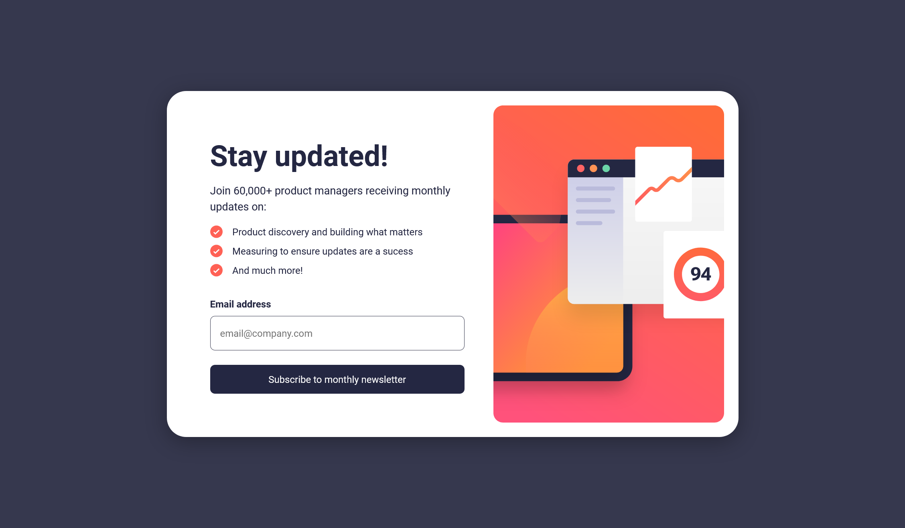

# Frontend Mentor - Newsletter sign-up form with success message solution

This is a solution to the [Newsletter sign-up form with success message challenge on Frontend Mentor](https://www.frontendmentor.io/challenges/newsletter-signup-form-with-success-message-3FC1AZbNrv).

### The Challenge

Users should be able to:

- Add their email and submit the form
- See a success message with their email after successfully submitting the form
- See form validation messages if:
  - The field is left empty
  - The email address is not formatted correctly
- View the optimal layout for the interface depending on their device's screen size
- See hover and focus states for all interactive elements on the page

### Links

- Github: [Add solution URL here](https://github.com/MorganGray28/newsletter-signup-form)
- Live Site: [Add live site URL here](https://newsletter-signup-form.vercel.app/)

### Built with

- React
- TypeScript
- Flexbox
- Vite
